# Saiency Map-aided GAN for RAW2RGB Mapping

The PyTorch implementations and guideline for Saiency Map-aided GAN for RAW2RGB Mapping.

## 1 Implementations

Before running it, please ensure the environment is `Python 3.6` and `PyTorch 1.0.1`.

### 1.1  Train

If you train it from scratch, please download the saliency map generated by our pre-trained [SalGAN](https://portland-my.sharepoint.com/:u:/g/personal/yzzhao2-c_ad_cityu_edu_hk/EYH8wcYdU7xKjksv9HJIa2oBm7W0702P2_vPnDMv8Jt3Rg?e=yIEV8M).

Stage 1:
```bash
python train.py     --in_root [the path of TrainingPhoneRaw]
		    --out_root [the path of TrainingCanonRGB]
		    --sal_root [the path of TrainingCanonRGB_saliency]
```
Stage 2:
```bash
python train.py     --epochs 30
                    --lr_g 0.0001
                    --in_root [the path of TrainingPhoneRaw]
                    --out_root [the path of TrainingCanonRGB]
                    --sal_root [the path of TrainingCanonRGB_saliency]
```
```bash
if you have more than one GPU, please change following codes:
python train.py     --multi_gpu True
                    --gpu_ids [the ids of your multi-GPUs]
```

The training pairs are normalized to (H/2) * (W/2) * 4 from H * W * 1 in order to save as .png format. The 4 channels represent R, G, B, G, respectively. You may check the original Bayer Pattern:

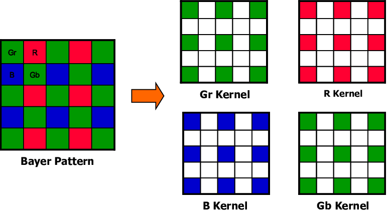 

The training pairs are shown like this:

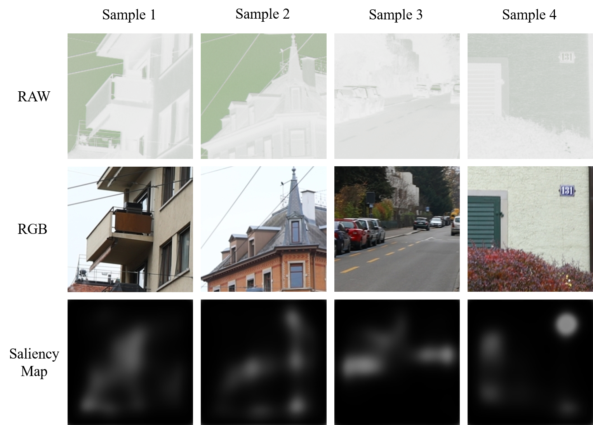

Our system architecture is shown as:

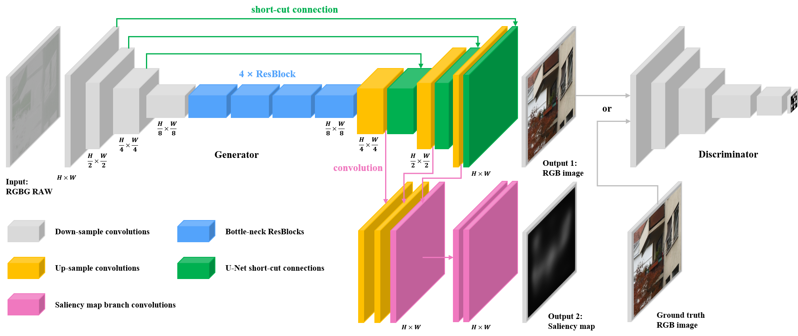

### 1.2  Test

At testing phase, please create a folder first if the folder is not exist.

Please download the pre-trained [model](https://portland-my.sharepoint.com/:u:/g/personal/yzzhao2-c_my_cityu_edu_hk/EfDp5EqW-RtLj6Z-FsxLEp0Bjz0HAgBWJyD2Q3rnJBRnXA?e=HfmfPd) first.

For small image patches:
```bash
python test.py 	    --netroot 'zyz987.pth' (please ensure the pre-trained model is in same path)
		    --baseroot [the path of TestingPhoneRaw]
		    --saveroot [the path that all the generated images will be saved to]
```

For full resolution images:
```bash
python test_full_res.py
or python test_full_res2.py
--netroot 'zyz987.pth' (please ensure the pre-trained model is in same path)
--baseroot [the path of FullResTestingPhoneRaw]
--saveroot [the path that all the generated images will be saved to]
```

Some randomly selected patches are shown as:

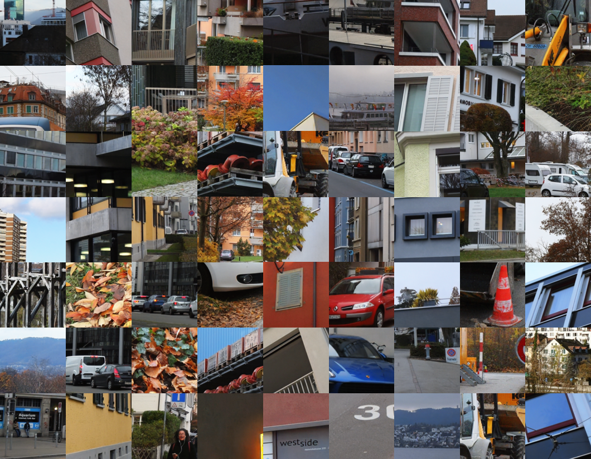

## 2 Comparison with Pix2Pix

We have trained a Pix2Pix framework using same settings.

Because both systems are trained only with L1 loss at first stage, the generated samples are obviously more blurry than second stage. There is artifact in the images produced by Pix2Pix due to Batch Normalization. Moreover, we show the results produced by proposed architecture trained only with L1 loss for 40 epochs. Note that, our proposed system are optimized by whole objectives for last 30 epochs. It demonstrates that adversarial training and perceptual loss indeed enhance visual quality.


## 3 Full resolution results

Because the memory is not enough for generate a high resolution image, we alternatively generate patch-by-patch.


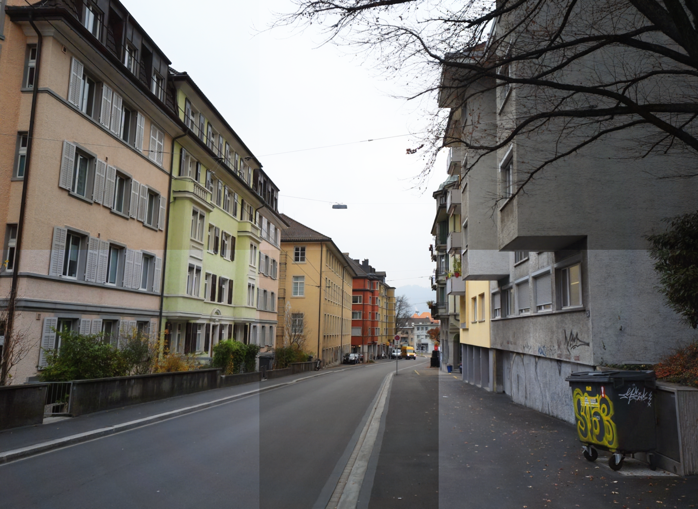

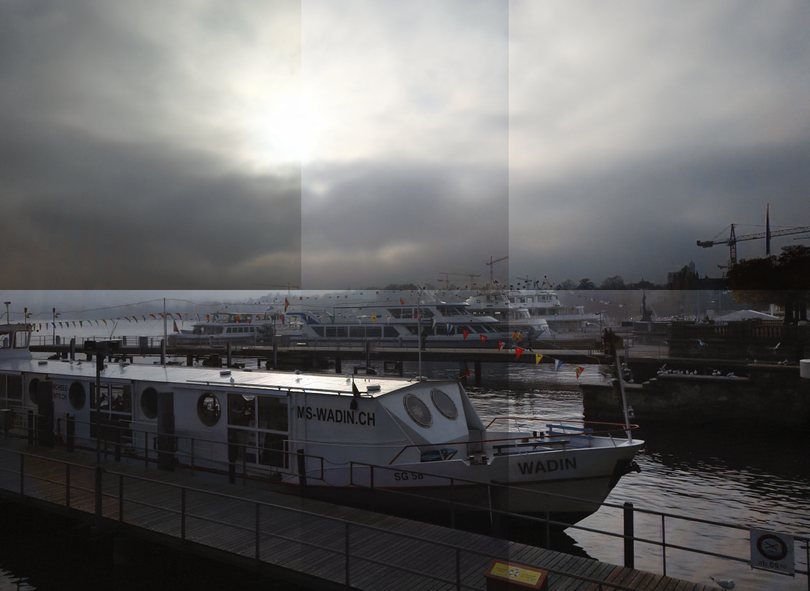

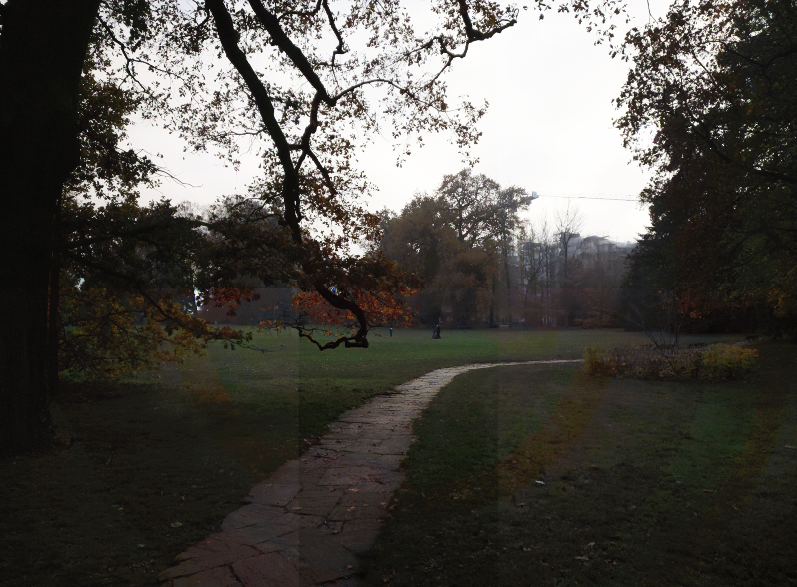


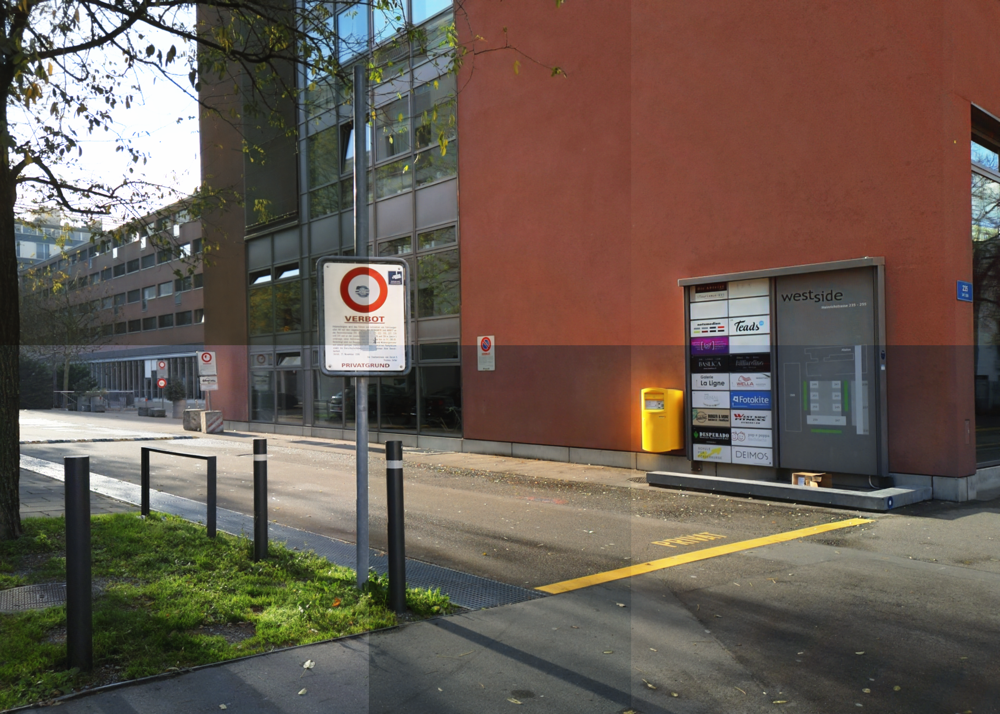

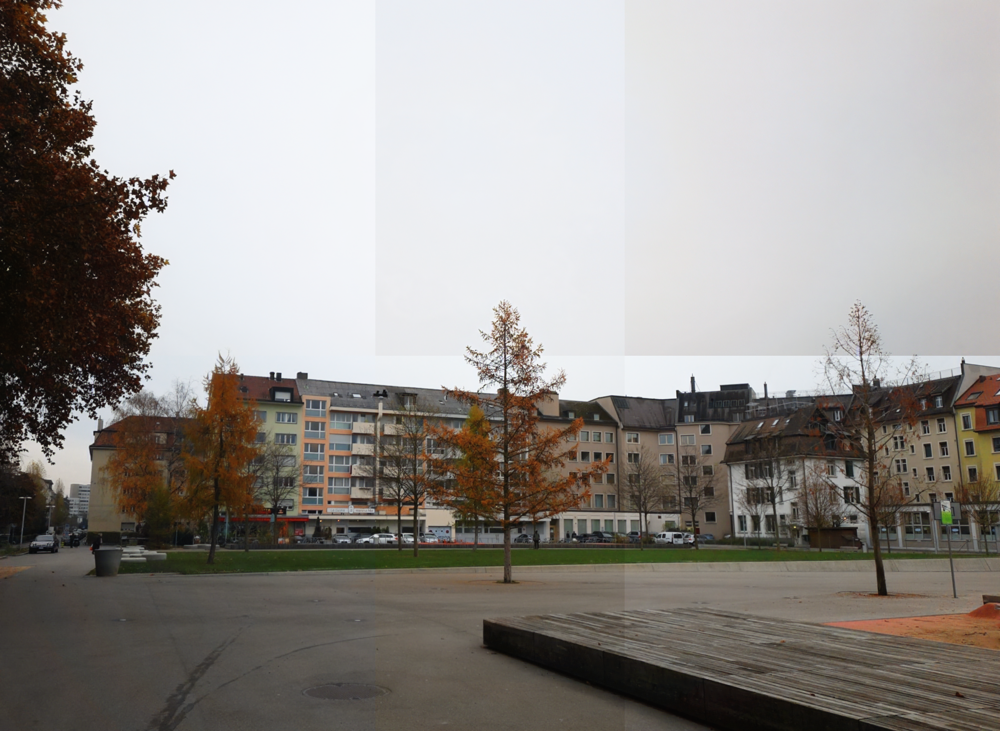

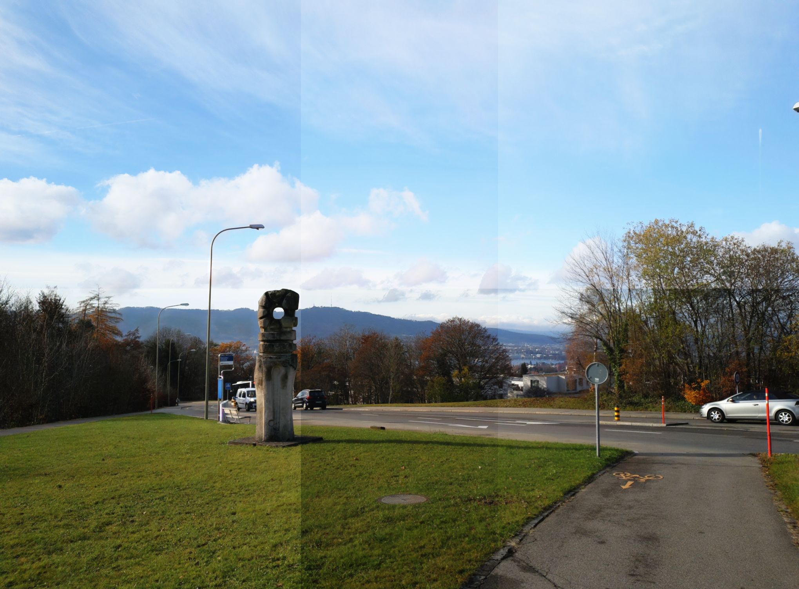


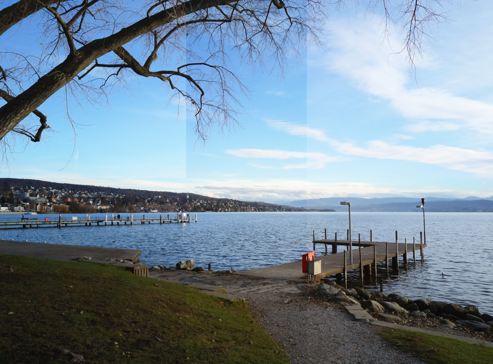

## 4 Poster


## 5 Related Work

The privious phone photo enhancers:

- Andrey Ignatov, Nikolay Kobyshev, Radu Timofte, Kenneth Vanhoey, and Luc Van Gool. Dslr-quality photos on mobile devices with deep convolutional networks. In Proceedings of the IEEE International Conference on Computer Vision, pages 3277–3285, 2017.

- Andrey Ignatov, Nikolay Kobyshev, Radu Timofte, Kenneth Vanhoey, and Luc Van Gool. Wespe: weakly supervised photo enhancer for digital cameras. In Proceedings of the IEEE Conference on Computer Vision and Pattern Recognition Workshops, pages 691–700, 2018.

The conditional image generation:

- Phillip Isola, Jun-Yan Zhu, Tinghui Zhou, and Alexei A Efros. Image-to-image translation with conditional adversarial networks. In Proceedings of the IEEE Conference on Computer Vision and Pattern Recognition, pages 1125– 1134, 2017.

- Jun-Yan Zhu, Taesung Park, Phillip Isola, and Alexei A Efros. Unpaired image-to-image translation using cycleconsistent adversarial networks. In Proceedings of the IEEE International Conference on Computer Vision, pages 2223– 2232, 2017.

## 6 Reference

If you have any question, please do not hesitate to contact yzzhao2-c@my.cityu.edu.hk

If you find this code useful to your research, please consider citing:

```
@inproceedings{zhao2019saliency,
  title={Saliency map-aided generative adversarial network for raw to rgb mapping},
  author={Zhao, Yuzhi and Po, Lai-Man and Zhang, Tiantian and Liao, Zongbang and Shi, Xiang and others},
  booktitle={2019 IEEE/CVF International Conference on Computer Vision Workshop (ICCVW)},
  pages={3449--3457},
  year={2019},
  organization={IEEE}
}
```

An extention of this work can be found at: https://github.com/zhaoyuzhi/Semantic-Colorization-GAN

```bash
@article{zhao2020scgan,
  title={SCGAN: Saliency Map-guided Colorization with Generative Adversarial Network},
  author={Zhao, Yuzhi and Po, Lai-Man and Cheung, Kwok-Wai and Yu, Wing-Yin and Abbas Ur Rehman, Yasar},
  journal={IEEE Transactions on Circuits and Systems for Video Technology},
  year={2020},
  publisher={IEEE}
}
```
